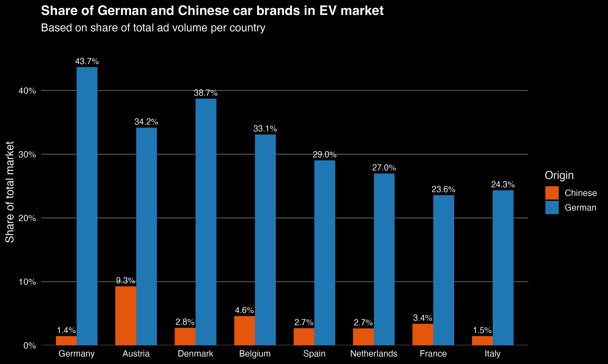

Column {data-width=50%}
-----------------------------------------------------------------------

### German vs Chinese share – Total Market
```{r total_plot, echo=FALSE}

```

Column {data-width=50%}
-----------------------------------------------------------------------

### German vs Chinese share – EV Market
```{r ev_plot, echo=FALSE}

```


